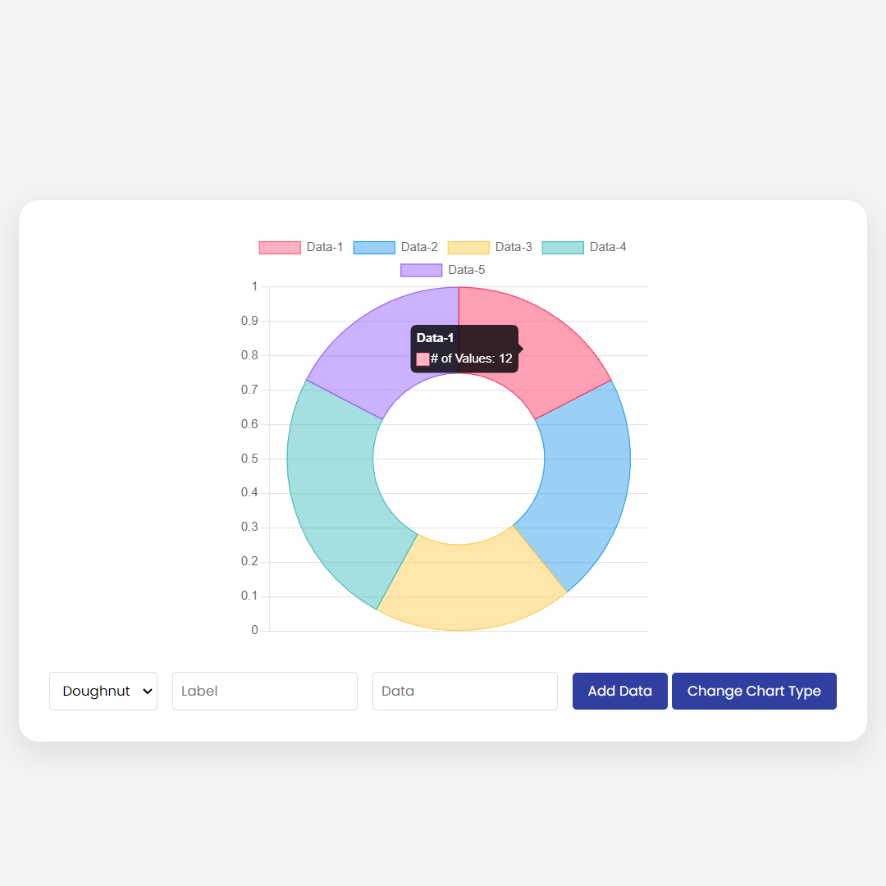

# Live chart

This is a real-time graphing application created using HTML, CSS, and JavaScript. Simply enter your data and the charts will refresh instantly. It's ideal for anybody who need speedy, dynamic data visualization, whether for corporate presentations, academic projects, or personal usage. With this useful tool, you can create charts that are both smooth and dynamic!

### 🌟 What You'll Learn:
- Understanding Chart.js: Get to grips with the basics of this versatile library and how it can transform your data visualization game.
- Real-Time Data Integration: Learn how to seamlessly feed live data into your charts.
- Five Chart Modes: Explore five different chart types - from line graphs to bar charts, and understand when and how to use them effectively.

# Screenshot
Here we have project screenshot :

